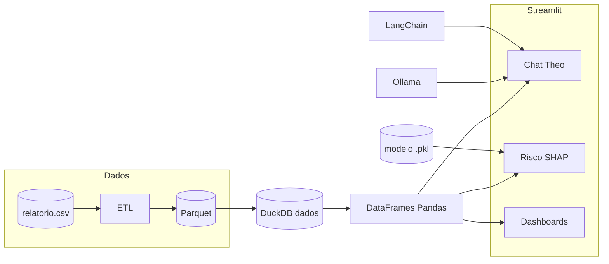

# Passos Mágicos — Painel analítico e assistente Theo
Como o repositório parece ser privado ou ainda não foi indexado publicamente nas buscas, não consigo acessar o código diretamente. Porém, olhando pelo nome (**"theo-educational-analytics-assistant"**), fica claro que se trata de um assistente inteligente voltado para análise de dados educacionais (provavelmente integrado com o Ollama executando localmente e usando Streamlit ou um executável empacotado).
```markdown
## 🚀 Como Executar o Théo Localmente

Siga o passo a passo abaixo para clonar o repositório, preparar o ambiente e rodar o assistente de análise educacional na sua máquina.

### 📋 Pré-requisitos

Antes de começar, certifique-se de ter instalado e configurado:
1. **Ollama:** Baixe e instale o [Ollama](https://ollama.com/). Ele é necessário para rodar os modelos de linguagem locais.
2. **Modelo de LLM:** Certifique-se de baixar o modelo que o Théo utiliza. Com o Ollama rodando, execute o comando abaixo no seu terminal Llama 3:
   ```bash
   ollama run llama3

```

3. **Git:** Caso queira clonar o projeto via linha de comando.

---

### 🛠️ Passo a Passo para Execução

#### 1. Clonar o Repositório

Abra o seu terminal e execute o comando abaixo para clonar o projeto:

```bash
git clone [https://github.com/J034ll4n/theo-educational-analytics-assistant.git](https://github.com/J034ll4n/theo-educational-analytics-assistant.git)

```

#### 2. Acessar a Pasta do Projeto

Navegue até o diretório onde o projeto foi baixado:

```bash
cd theo-educational-analytics-assistant

```

#### 3. Verificar o Ollama

Certifique-se de que o ícone do Ollama está ativo na sua barra de tarefas (rodando em segundo plano). O assistente precisa dele para processar as requisições de IA em tempo real.

#### 4. Iniciar o Assistente

Abra o gerenciador de arquivos do seu sistema, vá até a pasta do projeto e **execute o arquivo/ícone de inicialização**.

Pronto! Agora você já pode testar todas as funcionalidades de análise de dados educacionais e interagir com o Théo localmente.
--

**Autor:** Joe Allan Zirn · **Contexto:** projeto académico (Postech FIAP · Fase 5) — dados educacionais para apoio à decisão pedagógica.

Aplicação **Streamlit** com assistente **Theo** (linguagem natural → SQL sobre **DuckDB**/**Parquet**), **dashboards**, **risco escolar** (ML com **SHAP**), **dicionário de dados editável** e **relatório institucional** integrado. Dados e inferência podem permanecer no equipamento local.

## Índice

- [1. Objetivos do projeto](#1-objetivos-do-projeto)
- [2. Stack tecnológica](#2-stack-tecnológica)
- [3. Arquitetura](#3-arquitetura-visão-geral)
- [4. Dados e pipeline](#4-dados-e-pipeline)
- [5. Modelo de machine learning](#5-modelo-de-machine-learning-risco-do-aluno)
- [6. Assistente Theo](#6-assistente-theo-chat-analítico)
- [7. Páginas da aplicação](#7-páginas-da-aplicação-streamlit)
- [8. Pré-requisitos](#8-pré-requisitos)
- [9. Instalação e execução](#9-instalação-e-execução)
- [10. Configuração, secrets e deploy](#10-configuração-secrets-e-deploy)
- [11. Testes automatizados](#11-testes-automatizados)
- [12. Privacidade e ética de dados](#12-privacidade-e-ética-de-dados)
- [13. Estrutura de pastas](#13-estrutura-de-pastas-resumo)
- [14. Referências](#14-referências-e-continuidade-do-trabalho)

---

## 1. Objetivos do projeto

- Disponibilizar uma interface única para explorar indicadores (INDE, IDA, IAN, IEG, IPV, etc.) e contexto do aluno (fase, turma, pedra, instituição).
- Permitir perguntas em português ao **Theo**, que gera **SQL** sobre uma base **DuckDB** alimentada por **Parquet**, devolvendo tabelas, gráficos e narrativa.
- Estimar **probabilidade de alto risco** com um modelo de ML alinhado ao notebook de treino, com **SHAP**, texto de **olhar pedagógico** (posição do INDE face à média do grupo e trajetória) e **cenários quantificados** (variações de indicadores) que entram automaticamente no **parecer do Theo** — sem simulador manual extra na interface.
- Incorporar o **relatório anual** (apresentação Gamma) na aplicação e dar ao Theo **contexto textual** extraído do mesmo conteúdo (ficheiro Markdown em `assets/`), para respostas alinhadas ao relatório sem confundir com colunas da base.
- Garantir **privacidade**: LLM via **Ollama** em localhost; sem envio obrigatório de dados de alunos a APIs externas.

### 1.1 Expectativas sobre o modelo e o assistente (leia antes da demo)

- **Risco (ML):** a probabilidade na interface é uma **estimativa estatística** treinada em dados históricos. **Não** substitui parecer pedagógico, CIEP, regras da escola nem visita à sala. Os limiares (ex.: 46%) são **marcas operacionais** para leitura na app, não verdades absolutas sobre uma criança.
- **Theo (LLM):** pode **alucinar** ou gerar SQL **incorreto**; as respostas devem ser **verificadas** (tabela devolvida, ordens de grandeza). Perguntas “institucionais” usam texto de contexto (Gamma/resumo), não a base linha a linha.
- **MVP em nuvem:** dashboards e risco podem funcionar **sem** Ollama; o chat Theo e o parecer automático dos dashboards dependem de **Ollama + LangChain** quando quiser LLM local ou cache pré-gerado.

---

## 2. Stack tecnológica

| Camada | Tecnologias |
|--------|-------------|
| Interface | [Streamlit](https://streamlit.io/) |
| Dados | [Pandas](https://pandas.pydata.org/), [PyArrow](https://arrow.apache.org/docs/python/) |
| Motor analítico | [DuckDB](https://duckdb.org/) sobre Parquet |
| Gráficos | [Plotly](https://plotly.com/python/) |
| LLM | [Ollama](https://ollama.com/) + [LangChain](https://python.langchain.com/) (comunidade) |
| ML | [scikit-learn](https://scikit-learn.org/), [imbalanced-learn](https://imbalanced-learn.org/) (SMOTE), [XGBoost](https://xgboost.readthedocs.io/), [SHAP](https://shap.readthedocs.io/) |
| Empacotamento | `venv`, `requirements.txt`, `run.bat` (Windows), `run.sh` (Linux/macOS), tarefa de build em `.vscode/tasks.json` |

---

## 3. Arquitetura (visão geral)

```
relatorio.csv  ──►  ETL (scripts/etl.py)  ──►  dados.parquet
                                                    │
notebooks/Ml/  ──►  treino (notebook)   ──►  modelo_risco_aluno.pkl
                                                    │
                                                    ▼
                    app/main.py (Streamlit) ◄── passos_magico/
                         │                      ├── data_engine/ (loader, SQL)
                         │                      ├── llm/ (Theo, prompts, router)
                         │                      └── ml/ (pipeline de risco, inferência)
```

- **`passos_magico/data_engine`:** resolução do caminho do Parquet, normalização de colunas (aliases RA/Nome/Ano…), execução de SQL.
- **`passos_magico/llm`:** orquestração do assistente, prompts, deteção de perguntas “só institucionais”, geração de gráficos, **cenários de risco** para o painel (`ml_scenarios.py`) e texto de diagnóstico (`ml_text.py`).
- **`passos_magico/ml`:** engenharia de atributos espelhada do notebook (`risk_pipeline.py`), carregamento do modelo (`inference.py`), utilidades de UI para risco.
- **`app/main.py`:** páginas, cache de dados e modelo, CSS global.

### 3.1 Visão em camadas (de cima para baixo)

**Camada de experiência (UI)**  
- Aplicação **Streamlit** (`app/main.py`): menu lateral (**Chat analítico**, **Relatório anual**, **Previsão de risco**, **Dashboards**, **Dicionário de dados**), tema escuro em `.streamlit/config.toml`.  
- O utilizador **não** escreve SQL; interage em **português**.

**Camada de orquestração (`app/` + pacote)**  
- **`app/`:** entrada, CSS global, **`cached`** (dados e modelo em cache de sessão).  
- **`passos_magico/`:** núcleo do produto — motor de dados, LLM, ML, UI dos dashboards, fusão semântica (dicionário + dados).

**Camada analítica**  
- **DuckDB** sobre ficheiro **Parquet** (view lógica **`dados`**): o SQL gerado pelo assistente executa-se aqui.  
- **Plotly** para gráficos no chat e nos ecrãs de risco.

**Camada de inteligência**  
- **Theo (LLM):** **Ollama** local + **LangChain** — gera SQL, corrige SQL em caso de erro, narra resultados, sugere perguntas; *router* para perguntas só “institucionais” (texto Gamma, sem inventar colunas na tabela `dados`).  
- **ML:** pipeline **scikit-learn** / **XGBoost** (bundle `modelo_risco_aluno.pkl`), **SHAP**; **cenários “e se…”** são calculados em código (`passos_magico/llm/ml_scenarios.py`) e enviados ao Theo como bloco Markdown, para o texto citar percentagens coerentes com o modelo.

**Camada de dados persistente**  
- **`data/relatorio.csv`** → **ETL** (`scripts/etl.py`) → **`data/dados.parquet`** (e/ou prioridade **`notebooks/Ml/relatorio_final.parquet`** via `PASSOS_PARQUET` / `get_parquet_path()`).  
- **`dicionario.json`:** descrições por coluna que alimentam os prompts do Theo.

**Camada de contexto institucional (não tabular)**  
- Markdown em **`assets/`** (ex.: relatório Gamma), resumos anuais — texto para o Theo **sem** ser confundido com o esquema SQL da base.

### 3.2 Fluxo de dados

1. **Origem:** CSV de relatório (`data/relatorio.csv`) ou Parquet já preparado.  
2. **ETL:** normalização, sentinélas, opcionalmente coluna **`risco`** se existir `modelo_risco_aluno.pkl`.  
3. **Armazenamento analítico:** Parquet (formato colunar).  
4. **Consumo:** DuckDB lê o Parquet; o Streamlit recebe resultados em **pandas** (`DataFrame`).  
5. **Saída:** tabelas, gráficos, métricas e exportação CSV (por exemplo, matriz de priorização de risco).

*Diagrama sugerido:* pipeline horizontal com as cinco etapas acima e setas sequenciais.

### 3.3 Fluxo do Chat analítico (Theo)

1. Pergunta em linguagem natural, bloco de **dicionário**, lista de **colunas verificadas** e regras de **ano operacional** (prompts).  
2. O **LLM** gera um `SELECT` DuckDB sobre **`dados`**.  
3. **Validação e correção** em ciclo curto se o SQL falhar.  
4. **Execução** → `DataFrame` → heurística de gráfico (**Plotly**) e narrativa em modo **KPI** ou **analítico**.  
5. Resposta em **Markdown**, com números alinhados à tabela (regras anti-alucinação nos prompts).

*Diagrama sugerido:* **Pergunta → SQL → DuckDB → Tabela ou gráfico → Narrativa**, com ramo **Ollama (local)** para geração de SQL e texto.

### 3.4 Fluxo de risco (ML)

1. Carregar o **Parquet** ativo + o **bundle** do modelo.  
2. **Engenharia de features** alinhada ao notebook (`ensure_risk_engineering`, agregações por RA / turma / instituição); na app, matriz e ficha usam o **mesmo contexto de dataset completo** onde aplicável, para **probabilidades coerentes** entre vistas.  
3. **Duas vistas:** ficha individual (**olhar pedagógico**, gráfico **SHAP** de fatores, parecer do **Theo** com cenários numéricos) e **matriz de priorização** (filtros ano / fase / turma, exportação). Não há gráfico adicional de barras INDE aluno vs média do grupo (a comparação aparece em texto no olhar pedagógico quando os dados permitem).  
4. Limiar operacional (ex.: **46%**) é apenas **marca de UI** para leitura — não substitui decisão pedagógica ou norma da escola.

### 3.5 Diagrama lógico (Mermaid)

O diagrama seguinte é interpretado pelo GitHub na visualização do ficheiro.



---

## 4. Dados e pipeline

### Ficheiro de entrada padrão

- **`data/relatorio.csv`** — exportação tabular com colunas em minúsculas (ex.: `ra`, `ano_referencia`, `inde`, `ian`, …). Este é o ficheiro que deve ser atualizado quando chegam novos dados.

### Parquet usado pela aplicação

A função `get_parquet_path()` em `passos_magico/data_engine/loader.py` escolhe, por ordem:

1. Variável de ambiente **`PASSOS_PARQUET`** (caminho absoluto para um `.parquet` alternativo), se definida;
2. **`notebooks/Ml/relatorio_final.parquet`**, se existir (prioridade típica após ETL/notebook);
3. Caso contrário, **`data/dados.parquet`**.

O ETL em **`scripts/etl.py`** lê `data/relatorio.csv`, normaliza (incluindo sentinélas `-999` → ausente), opcionalmente preenche a coluna **`risco`** se existir modelo carregável, e grava **`data/dados.parquet`**.

### Dicionário semântico

- **`dicionario.json`** — descrições por coluna; o Theo usa este texto como contexto ao gerar SQL e respostas. A página **Dicionário de dados** permite editar e guardar.

---

## 5. Modelo de machine learning (risco do aluno)

### Artefacto principal

- **`modelo_risco_aluno.pkl`** na **raiz do projeto** — ficheiro único que a aplicação carrega para probabilidade de alto risco.

### O que “roda” dentro do modelo (estrutura do `.pkl`)

O ficheiro **não** é só um algoritmo isolado: é um **Pipeline** (scikit-learn + imbalanced-learn) com três etapas na ordem:

1. **`pre` (ColumnTransformer)** — imputação por **mediana** e **StandardScaler** nas variáveis numéricas; **OneHotEncoder** (`handle_unknown='ignore'`) nas categóricas (`fase`, `genero`, `instituicao_de_ensino`, `pedra`).
2. **`smote` (SMOTE)** — sobreamostragem sintética da classe minoritária **apenas no conjunto de treino** dentro de cada fold, para reduzir viés de desequilíbrio entre “sem risco” e “com risco”.
3. **`clf` (classificador)** — o vencedor de uma **competição** entre vários algoritmos, escolhido por **validação cruzada** com métrica **F2** (favorece *recall* da classe positiva, adequado quando o risco é raro).

Candidatos tipicamente avaliados no notebook: **Random Forest**, **XGBoost** (`XGBClassifier`), **regressão logística**, **Gradient Boosting** (sklearn) e **Extra Trees**. O classificador com melhor F2 médio na CV é o que fica gravado no passo `clf`.

### Alvo (rótulo) e variáveis

- **Alvo binário** `alvo_risco`: definido por transição **ano seguinte** com o mesmo aluno (`ra`): condição de risco se o **IAN** cair ou se a **queda do INDE** para o ano seguinte for superior ao limiar definido no notebook (evolução desfavorável).
- **Features numéricas** incluem indicadores brutos (idade, IAA, IEG, IPS, IDA, …), derivadas temporais por aluno (`delta_inde`, `std_inde`, `media_inde`, `tendencia_inde`, …) e construtos pedagógicos (`distancia_media_turma`, `choque_realidade`, `esforco_sem_resultado`, `mudanca_pedra`, etc.).
- **Partição treino/teste:** **GroupShuffleSplit** (~80/20) com agrupamento por **`ra`**, para não misturar linhas do mesmo aluno entre treino e teste (reduz *leakage* temporal).

### Escolhas metodológicas (porquê assim)

| Escolha | Motivo |
|--------|--------|
| **Grupos por RA** no *split* e na CV (**GroupKFold**) | O aluno não aparece em treino e teste ao mesmo tempo; métricas refletem generalização a **novos alunos**, não a novas linhas do mesmo histórico. |
| **F2 na pesquisa de hiperparâmetros** | Em risco escolar importa não deixar passar casos positivos; F2 dá mais peso ao *recall* da classe 1 do que F1. |
| **SMOTE dentro do pipeline** | Equilibrar classes sem abandonar o fluxo sklearn; o passo aplica-se só onde o pipeline é treinado. |
| **Vários modelos + RandomizedSearchCV** | Explorar hiperparâmetros com custo computacional controlado (`n_iter` limitado) e escolher o melhor candidato de forma reprodutível (`random_state` fixo). |
| **Análise de limiar no notebook** | Além do corte 0,5 do `predict`, o notebook procura um **limiar de probabilidade** que maximiza F2 no conjunto de teste — útil para interpretação; a **UI** continua a expor sobretudo a **probabilidade** contínua (0–1). |

### Métricas e resultados reportados no treino

Após o treino, o **notebook** imprime (sobre o conjunto de **teste**, ~20% dos alunos):

- **Ranking** dos candidatos pelo melhor **F2** obtido na CV;
- **Acurácia**, **ROC-AUC**, **PR-AUC** (*average precision*), **precisão / *recall* / F1** por classe e médias macro;
- **Matriz de confusão** (TN, FP, FN, TP);
- **`classification_report`** com limiar 0,5 e, em separado, com o **limiar que maximiza F2** no teste (valores de corte são indicativos e dependem do *split*).

Os **números exatos** dependem do CSV, da semente e do *split*; devem ser **copiados da última execução do notebook** para o relatório escrito da disciplina. A título **ilustrativo** (uma execução local sobre o `data/relatorio.csv` de exemplo do repositório), obtiveram-se ordens de grandeza como: **XGBoost** escolhido na competição, **ROC-AUC ≈ 0,91**, **PR-AUC ≈ 0,64**, acurácia com limiar 0,5 na ordem de **0,79–0,89**, com matriz de confusão a mostrar poucos **falsos negativos** (riscos não detetados) e trade-off com **falsos positivos** conforme o limiar — validar sempre com a saída atual do vosso notebook.

### Código partilhado com a inferência na app

- **`passos_magico/ml/risk_pipeline.py`** — replica a engenharia de atributos quando os dados vêm do Parquet (incluindo variantes de grafia em “Pedra”, idade a partir de datas, etc.).
- **`passos_magico/ml/inference.py`** — carrega o `.pkl`, `predict_proba`, predição em lote, SHAP quando aplicável.

### Alinhamento entre Parquet, coluna `risco` e o Theo

O SQL do Theo incide sobre a **mesma** vista tabular **`dados`** (DuckDB em cima do `DataFrame` carregado do Parquet; ver §4 e `get_parquet_path()`). A coluna **`risco`** é preenchida no Parquet pelo ETL quando o modelo existe, ou calculada em memória por `ensure_risco_column` / `predict_risk_probabilities` ao preparar o *runner* do chat (`app/cached.py`). Não existe uma base paralela “só para o modelo”: o modelo **enriquece** a tabela que o assistente consulta.

---

## 6. Assistente Theo (chat analítico)

Fluxo resumido: ver **§3.3**. Em seguida, o comportamento operacional e os ficheiros de contexto.

- O utilizador formula perguntas em linguagem natural.
- O sistema constrói contexto a partir do **dicionário**, opcionalmente **`resumo_anual.txt`**, e do texto do relatório Gamma em **`assets/relatorio_gamma_context.md`** (ou override **`.passos_gamma_context.txt`** na raiz, ignorado pelo Git se configurado).
- Para perguntas que pedem só narrativa institucional (ex.: resumo, relatório, Gamma), o encaminhamento em **`passos_magico/llm/institutional_router.py`** evita SQL desnecessário.
- Para perguntas quantitativas, o fluxo gera **SQL** sobre a tabela **`dados`** no DuckDB — **os mesmos dados do Parquet**, incluindo **`risco`** quando calculada ou já persistida (ver secção 5, último subcapítulo) — e pode produzir **gráficos Plotly**.

Configuração Ollama: **`passos_magico/llm/config.py`** (`OLLAMA_MODEL`, `OLLAMA_BASE_URL`, `OLLAMA_NUM_CTX`, `OLLAMA_REQUEST_TIMEOUT` em segundos por pedido, ou variáveis de ambiente homónimas).

---

## 7. Páginas da aplicação Streamlit

| Página | Função |
|--------|--------|
| **Chat analítico** | Theo + SQL + gráficos |
| **Relatório anual** | Site Gamma embebido por iframe; URL por defeito configurável |
| **Previsão de risco** | **Análise individual:** métricas da ficha, **olhar pedagógico** (INDE vs média do grupo e variação no tempo), **SHAP** (Plotly) e **Theo** (Markdown) com **cenários já calculados** pelo backend. **Matriz de priorização:** filtros, métricas de recorte, exportação CSV |
| **Dashboards** | KPIs e gráficos (estilo claro); parecer do Theo em `data/dashboard_theo_feedback.txt`, regenerado só quando os dados mudam |
| **Dicionário de dados** | Edição do dicionário e pré-visualização Parquet/CSV |

### Relatório anual (Gamma)

- URL por defeito no código: `https://datathon-passos-magicos-sojo7d1.gamma.site/` (apresentação Gamma do desafio).
- Personalização: variável **`PM_RELATORIO_ANUAL_GAMMA_URL`** ou secret Streamlit **`RELATORIO_ANUAL_GAMMA_URL`**.
- O Theo **não lê a página em tempo real**; usa o ficheiro Markdown em **`assets/relatorio_gamma_context.md`** — deve ser atualizado quando o conteúdo do site mudar, para manter coerência das respostas.

---

## 8. Pré-requisitos

1. **Sistema operativo:** Windows (`run.bat`), Linux ou macOS (`run.sh`); em alternativa, comandos manuais equivalentes (§9).
2. **Python 3.10 ou superior** (`py`, `python3` ou `python` no PATH).
3. **Ollama** (opcional mas necessário para o chat Theo e pareceres LLM) — ver **§8.1**.
4. **`data/relatorio.csv`** para ETL completo; se ausente, o ETL pode gerar um CSV de exemplo (`scripts/etl.py`).

### 8.1 Ollama: do download ao teste com o **mesmo modelo** da app

O código usa por defeito o modelo **`llama3`** no endpoint local (`passos_magico/llm/config.py` → `OLLAMA_MODEL`, predefinição `llama3`).

1. **Instalar Ollama** (Windows): descarregar o instalador em [ollama.com/download](https://ollama.com/download), instalar e confirmar que a app **Ollama** fica a correr em segundo plano (ícone na bandeja).
2. **Descarregar o modelo** (PowerShell ou terminal):

   ```bash
   ollama pull llama3
   ```

   Se preferires outro modelo suportado pelo Ollama, define **`OLLAMA_MODEL=nome_do_modelo`** antes de iniciar o Streamlit (tem de existir em `ollama list`).
3. **Verificar o serviço:** no browser, abrir `http://127.0.0.1:11434/` — deve responder (API local).
4. **Teste rápido no terminal:**

   ```bash
   ollama run llama3 "Diz olá em uma frase."
   ```

   Se responder, o motor está OK.
5. **Alinhar com a app:** com o mesmo nome em `OLLAMA_MODEL` (ou `llama3` por defeito), arrancar o Streamlit (**§9**). Na página **Chat analítico**, testar com uma pergunta simples (ex.: *«Quantos registos existem na base no total?»*); lista de *smoke tests:* `data/theo_20_smoke_perguntas.txt`.
6. **Timeouts:** pedidos longos podem estourar o tempo máximo; aumenta **`OLLAMA_REQUEST_TIMEOUT`** (segundos) se o PC for mais lento.

**Testes automáticos com Ollama** (opcional, requer LangChain + Ollama a correr):

```bash
pytest tests/test_theo_e2e_optional.py -m ollama -v
```

---

## 9. Instalação e execução

### Arranque automático (recomendado)

| Plataforma | Ação |
|------------|------|
| **Windows** | Duplo clique em **`run.bat`** na raiz do repositório. |
| **Linux / macOS** | Na raiz: `chmod +x run.sh` (uma vez) e `./run.sh`. |
| **Cursor / VS Code** | Abrir a pasta do repositório e **Run Build Task** (`Ctrl+Shift+B`): tarefa **«Instalar dependências e executar app (Streamlit)»** (`.vscode/tasks.json`). |

O script cria **`.venv`**, executa **`pip install -r requirements.txt`**, corre o **ETL** se faltar `data/dados.parquet` (ou atualiza `risco` se existir `modelo_risco_aluno.pkl`), define **`PYTHONPATH`** na raiz e inicia o **Streamlit** (tema escuro em `.streamlit/config.toml`).

### Checklist antes do primeiro arranque

1. Clonar o repositório e abrir a **raiz** no explorador de ficheiros ou no IDE.  
2. Dispor de **`data/relatorio.csv`** (ou aceitar o CSV de exemplo gerado pelo ETL).  
3. Colocar **`modelo_risco_aluno.pkl`** na raiz quando for usar **previsão de risco** ou coluna `risco` no ETL (treino: `notebooks/Ml/ML_Passos_Magicos.ipynb`).

### Instalação manual (referência)

Windows (PowerShell ou `cmd`, na raiz):

```bat
py -3 -m venv .venv
.venv\Scripts\activate
pip install -r requirements.txt
python scripts\etl.py
set PYTHONPATH=%CD%
python -m streamlit run app\main.py
```

Linux / macOS: ativar `.venv/bin/activate`, depois os mesmos passos com `python3` ou `python` conforme o sistema.

O **`run.bat`** replica estes passos e volta a correr o ETL quando já existe `dados.parquet` e há **`modelo_risco_aluno.pkl`**, para atualizar a coluna **`risco`**.

**Atalho Windows:** pode existir **`Passos Mágicos.lnk`** na raiz (gerado por script PowerShell referenciado no `run.bat`, conforme o ambiente).

### Notebook de ML (`notebooks/Ml/ML_Passos_Magicos.ipynb`)

Se ao correr a primeira célula aparecer **`No module named 'numpy'`** (ou `pandas`, `sklearn`, etc.), o **kernel** do Jupyter está a usar um Python **sem** as dependências do projeto — clonar o repo **não** instala pacotes sozinho.

1. Na **raiz** do repositório, cria o ambiente virtual e instala tudo (igual ao bloco acima):

   ```bash
   python -m venv .venv
   .venv\Scripts\activate
   pip install -r requirements.txt
   ```

   No Linux/macOS: `source .venv/bin/activate` em vez de `Scripts\activate`.

2. **Liga o notebook a esse Python:** no Jupyter / VS Code / Cursor, **Kernel** ou **Select Interpreter** → escolhe **`.venv\Scripts\python.exe`** (Windows) ou **`.venv/bin/python`**.

3. (Opcional) Registar um kernel com nome fixo: `pip install ipykernel` e  
   `python -m ipykernel install --user --name passos-magicos --display-name "Passos Mágicos (.venv)"` — depois escolhe **Passos Mágicos (.venv)** como kernel do notebook.

---

## 10. Configuração, secrets e deploy

### 10.1 Variáveis de ambiente (local)

| Variável | Efeito |
|----------|--------|
| `PASSOS_PARQUET` | Caminho absoluto para o Parquet a usar em vez do predefinido |
| `OLLAMA_MODEL` | Nome do modelo no Ollama (ex.: `llama3`) |
| `OLLAMA_BASE_URL` | URL do serviço Ollama (predefinição `http://127.0.0.1:11434`) |
| `OLLAMA_NUM_CTX` | Tamanho do contexto (tokens) |
| `OLLAMA_REQUEST_TIMEOUT` | Tempo máximo (segundos) por chamada ao Ollama (predefinição 120) |
| `PM_RELATORIO_ANUAL_GAMMA_URL` | URL do relatório anual embebido |

### 10.2 Secrets no Streamlit Community Cloud

No painel da app → **Settings → Secrets**, define chaves com o **mesmo nome** das variáveis acima, em TOML. Exemplo:

```toml
# PASSOS_PARQUET = "/mount/.../dados.parquet"

OLLAMA_MODEL = "llama3"
OLLAMA_BASE_URL = "http://127.0.0.1:11434"
```

No **Streamlit Community Cloud** o processo **não** acede ao Ollama da máquina local. O chat com LLM local só funciona com um endpoint **público** (cenário avançado) ou em modo sem LLM (dashboards, risco, dados). Para demonstração completa do Theo, usar ambiente **local** ou VM com Ollama e a app no mesmo host.

### 10.3 Deploy na Streamlit Community Cloud

1. [share.streamlit.io](https://share.streamlit.io) → sessão com **GitHub**.  
2. **Create app** → repositório **`J034ll4n/theo-educational-analytics-assistant`**, branch **`main`**.  
3. **Main file path:** `app/main.py`.  
4. **Root directory:** vazio (raiz do repositório).  
5. **Advanced settings** → **Python 3.12** (predefinição da Community Cloud; [documentação](https://docs.streamlit.io/deploy/streamlit-community-cloud/deploy-your-app/deploy)).  
6. **Deploy** e aguardar o *build* de `requirements.txt`.  

O repositório inclui **`notebooks/Ml/relatorio_final.parquet`** e **`modelo_risco_aluno.pkl`** na raiz para arranque sem ficheiros adicionais. O chat Theo mostrará indisponibilidade de Ollama na Cloud; as restantes áreas permanecem utilizáveis para demo pública.

### 10.4 Reprodutibilidade e dry-run

1. `requirements.txt` fixa versões com `==`; opcionalmente gerar `pip freeze > requirements-lock.txt` após validação numa máquina limpa.  
2. **Dry-run:** usar o mesmo Parquet da apresentação; executar `python scripts/etl.py` se a origem for CSV; percorrer Chat, Risco e Dashboards antes de gravar ou apresentar.  
3. Confirmar **`modelo_risco_aluno.pkl`** e **`dicionario.json`** na raiz conforme o cenário de demo.

---

## 11. Testes automatizados

Na raiz, com o ambiente ativo:

```bash
pytest tests/
```

Inclui testes de SQL, catálogo de perguntas, risco (incluindo derivados do pipeline para cenários), parecer ML e componentes do assistente.

Testes **opcionais** que chamam o Ollama local (marcador `ollama` em `pytest.ini`; fazem `skip` se o serviço não estiver disponível):

```bash
pytest tests/ -m ollama
```

**20 perguntas smoke** (catálogo interno + ficheiro para colar no chat): `data/theo_20_smoke_perguntas.txt`. Teste só de catálogo (sem rede): `pytest tests/test_theo_smoke_catalog.py`.

---

## 12. Privacidade e ética de dados

- Dados de alunos e inferência ML podem processar-se **localmente**.
- O uso de LLM externo em nuvem **não** faz parte do fluxo por defeito; apenas Ollama local.
- Em contexto académico, dados reais devem ser tratados conforme a política da instituição (anonimização, consentimento, retenção).

---

## 13. Estrutura de pastas (resumo)

| Caminho | Conteúdo |
|---------|----------|
| `app/` | Entrada Streamlit, cache |
| `.streamlit/config.toml` | Tema **escuro** por defeito (`base = "dark"`), cores alinhadas à UI |
| `passos_magico/` | Pacote principal: motor de dados, LLM (Theo, prompts, cenários e parecer ML no painel de risco), ML, UI |
| `data/` | `relatorio.csv`, `dados.parquet`; opcionalmente `dashboard_theo_feedback.txt` (parecer Theo sobre dashboards, cache) |
| `assets/` | Ícones, slogan, contexto Markdown do relatório Gamma |
| `notebooks/Ml/` | Notebook de ML, dados de exemplo, Parquet opcional |
| `scripts/` | `etl.py` (CSV → Parquet, coluna `risco` se o modelo existir) |
| `tests/` | Testes `pytest` |
| Raiz | `modelo_risco_aluno.pkl`, `dicionario.json`, `requirements.txt`, `run.bat` |

---

## 14. Referências e continuidade do trabalho

- Notebook de ML: `notebooks/Ml/ML_Passos_Magicos.ipynb`
- Dependências: `requirements.txt`
- Para evoluções futuras: métricas de modelo no notebook, testes A/B de limiar operacional, pipeline CI, ou documentação de negócio em anexo à entrega académica.

---

*Entrega no âmbito da formação em dados e impacto social — Passos Mágicos / FIAP · Joe Allan Zirn.*
